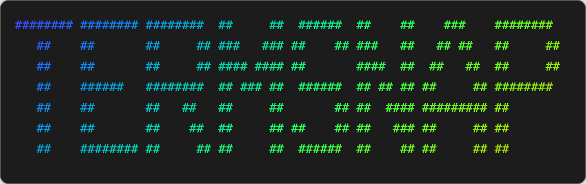
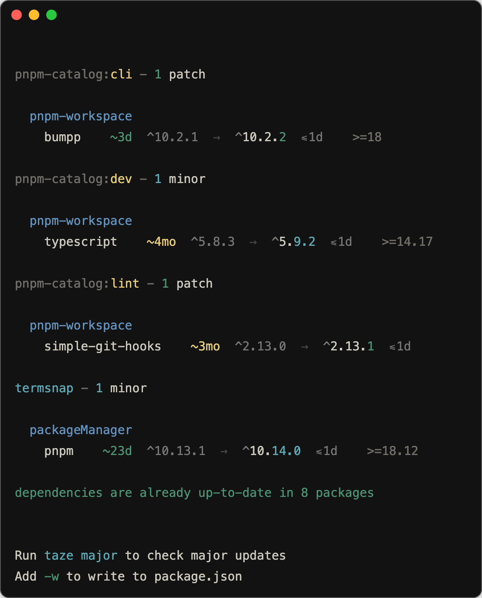

# termsnap

[![npm version][npm-version-src]][npm-version-href]
[![bundle][bundle-src]][bundle-href]
[![JSDocs][jsdocs-src]][jsdocs-href]
[![License][license-src]][license-href]

Creates beautiful screenshots of terminal command output with full local font and emoji support.

```sh
lolcat -f <(figlet -f banner3 tremsnap)
```

<p align='center'>

</p>

## Features

This project leverages Go-based terminal output proxy combined with web rendering technology to deliver pixel-perfect terminal screenshots.

- **Interactive Terminal Support**: Capture interactive terminal sessions through Go-based terminal output proxy
- **Local Font & Emoji Support**: Perfect rendering of your system fonts and emoji characters
- **Customizable Themes**: Extensive theme customization through configuration files
- **Multiple Output Formats**: Export as HTML, images (PNG/JPEG/WebP), or browser preview

## Usage Examples

```sh
# Browser preview
npx termsnap "ls -la" --open

# Save as HTML file
npx termsnap "git status" --html index.html

# Save as screenshot
npx termsnap "docker ps" --screenshot image.png

# Custom theme
npx termsnap "node --version" --open --theme vitesse-light
```

<p align='center'>

</p>

## Output Formats

Generate your terminal output in multiple formats:

- **HTML**: Save as standalone HTML file with embedded styling
- **Images**: Export as PNG, JPEG, or WebP formats
- **Browser Preview**: Open directly in browser (powered by [Broz](https://github.com/antfu/broz))

## Known Issues

In some cases, especially with custom fonts, width and height calculations may be inaccurate. When this occurs, you can manually set the `height` and `width` parameters to force specific viewport dimensions.

## Theme Customization

termsnap supports `termsnap.config.ts` for persistent configuration and theme customization. You can:

- Use built-in themes (vitesse, catppuccin, dracula)
- Create custom themes in `termsnap.config.ts`
- Find inspiration from [iTerm2-Color-Schemes](https://github.com/mbadolato/iTerm2-Color-Schemes)

## Configuration Options

### Server Settings
- `port` - Server port (default: 3000)
- `cdn` - CDN provider for xterm.js (jsdelivr, unpkg)

### Output Options
- `screenshot` - Generate screenshot and save to file
- `html` - Generate HTML template and save to file
- `open` - Open browser after generating HTML template

### Terminal Styling
- `theme` - Terminal theme (vitesse-dark, vitesse-light, catppuccin variants, dracula, etc.)
- `colors` - Custom terminal color configuration
- `height` - Terminal height
- `width` - Terminal width

### Font Configuration
- `fontFamily` - Terminal font family
- `fontSize` - Terminal font size
- `fontWeight` - Terminal font weight
- `lineHeight` - Terminal line height

### Border & Layout
- `borderRadius` - Terminal border radius
- `borderWidth` - Terminal border width
- `borderColor` - Terminal border color
- `boxShadow` - Terminal box shadow
- `padding` - Terminal padding
- `margin` - Terminal margin
- `decoration` - Draw window decorations (minimize, maximize, close buttons)

## Acknowledgments

This project was inspired by:
- [termshot](https://github.com/homeport/termshot) - Creates screenshots based on terminal command output
- [freeze](https://github.com/charmbracelet/freeze) - Generate images of code and terminal output 📸

## Why termsnap?

I wanted a simple way to create screenshots for my CLI tools to include in README files. However, existing tools had limitations with fonts, emoji support, and interactive terminal sessions. This led me to create termsnap - a terminal screenshot tool that feels like recording your terminal sessions with perfect fidelity.

## License

[MIT](./LICENSE) License © [jinghaihan](https://github.com/jinghaihan)

<!-- Badges -->

[npm-version-src]: https://img.shields.io/npm/v/termsnap?style=flat&colorA=080f12&colorB=1fa669
[npm-version-href]: https://npmjs.com/package/termsnap
[npm-downloads-src]: https://img.shields.io/npm/dm/termsnap?style=flat&colorA=080f12&colorB=1fa669
[npm-downloads-href]: https://npmjs.com/package/termsnap
[bundle-src]: https://img.shields.io/bundlephobia/minzip/termsnap?style=flat&colorA=080f12&colorB=1fa669&label=minzip
[bundle-href]: https://bundlephobia.com/result?p=termsnap
[license-src]: https://img.shields.io/badge/license-MIT-blue.svg?style=flat&colorA=080f12&colorB=1fa669
[license-href]: https://github.com/jinghaihan/termsnap/LICENSE
[jsdocs-src]: https://img.shields.io/badge/jsdocs-reference-080f12?style=flat&colorA=080f12&colorB=1fa669
[jsdocs-href]: https://www.jsdocs.io/package/termsnap
