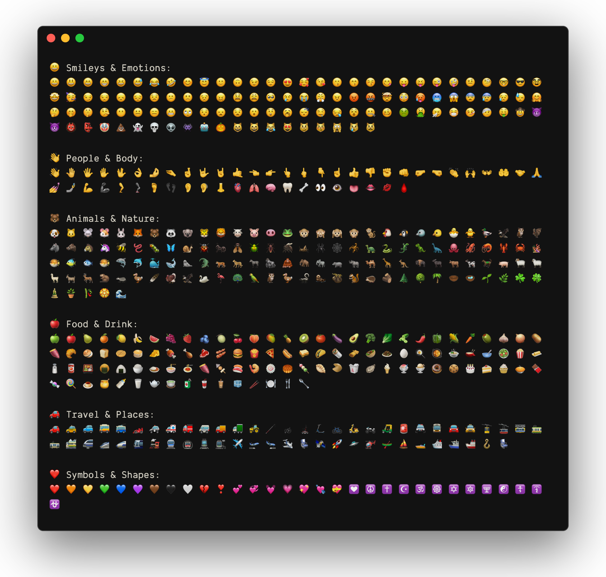

# termsnap

[![npm version][npm-version-src]][npm-version-href]
[![bundle][bundle-src]][bundle-href]
[![JSDocs][jsdocs-src]][jsdocs-href]
[![License][license-src]][license-href]

Creates beautiful screenshots, videos, and GIFs based on terminal command output. With full local font and emoji support.

```sh
npx termsnap "lolcat -f <(figlet -f banner3 termsnap)"
```

<p align='center'>

</p>

## Features

This project leverages Go-based terminal output proxy combined with web rendering technology to deliver pixel-perfect terminal screenshots.

- **Interactive Terminal Support**: Capture interactive terminal sessions through Go-based terminal output proxy
- **Local Font & Emoji Support**: Perfect rendering of your system fonts and emoji characters
- **Customizable Themes**: Extensive theme customization through configuration files
- **Multiple Output Formats**: Export as HTML, images (PNG/JPEG/WebP), animated GIFs, videos (MP4/AVI/MOV/WebM), or browser preview
- **Replay Animation**: Generate animated HTML or video output with typing effects

<p align='center'>

</p>

## Usage Examples

```sh
# Browser preview
npx termsnap "command" --open-replay

# Save as HTML file
npx termsnap "command" --html index

# Save as screenshot
npx termsnap "command" --png image

# Save as video
npx termsnap "command" --mp4 video --fps 60

# Save as animated GIF
npx termsnap "command" --gif animation --gif-fps 20 --gif-scale 720

# Custom theme and decoration
npx termsnap "command" --open --theme vitesse-light --decoration

# Save as animated HTML file
npx termsnap "command" --replay animated
```

<p align='center'>

</p>

## Output Formats

Generate your terminal output in multiple formats:

- **HTML**: Save as standalone HTML file with embedded styling
- **Images**: Export as PNG, JPEG, or WebP formats
- **Animated GIFs**: Export as optimized GIF with customizable frame rate and scale
- **Videos**: Export as MP4, AVI, MOV, or WebM formats with customizable frame rate
- **Browser Preview**: Open directly in browser (powered by [Broz](https://github.com/antfu/broz))

<div align="center">
  
  
</div>

## Theme Customization

termsnap supports `termsnap.config.ts` for persistent configuration and theme customization. You can:

- Use built-in themes (vitesse, catppuccin)
- Use remote themes from [iTerm2-Color-Schemes](https://github.com/mbadolato/iTerm2-Color-Schemes) VSCode directory
- Create custom themes in `termsnap.config.ts`

### Remote Themes

You can use any theme from the [iTerm2-Color-Schemes](https://github.com/mbadolato/iTerm2-Color-Schemes) VSCode directory. If the theme name is not in the built-in list, termsnap will automatically attempt to download it from the repository:

```sh
# Use a remote theme (e.g., 0x96f)
npx termsnap "command" --theme "0x96f"
```

## Animated Command Input

When using the `--replay` option to generate animated HTML output, you can customize the typing animation behavior through `typedOptions` configuration:

```typescript
// termsnap.config.ts
import { defineConfig } from './src/index'

export default defineConfig({
  typedOptions: {
    speed: 100, // Typing speed in milliseconds per character
    initialDelay: 0, // Initial delay before starting to type
    pauseAfter: 500 // Pause duration after typing completes
  }
})
```

## Configuration Options

### Server Settings
- `port` - Server port (default: 3000)
- `force` - Force to download the theme from remote

### Output Options
- `dpi` - Device pixel ratio for screenshot
- `png` - Generate png and save to file
- `jpeg` - Generate jpeg and save to file
- `webp` - Generate webp and save to file
- `gif` - Generate animated gif and save to file
- `gifFps` - Frames per second for gif output (default: 20)
- `gifScale` - Scale for gif output (default: 720)
- `fps` - Frames per second for video output (default: 60)
- `mp4` - Generate mp4 video and save to file
- `avi` - Generate avi video and save to file
- `mov` - Generate mov video and save to file
- `webm` - Generate webm video and save to file
- `html` - Generate HTML template and save to file
- `replay` - Generate animated HTML template and save to file
- `loop` - Loop the animation for a given number of milliseconds
- `open` - Open browser after generating HTML template
- `openReplay` - Open browser after generating animated HTML template

### Terminal Styling
- `theme` - Terminal theme (vitesse-dark, vitesse-light, catppuccin variants, etc.)
- `colors` - Custom terminal color configuration
- `height` - Terminal height
- `width` - Terminal width
- `decoration` - Draw window decorations (minimize, maximize, close buttons)
- `cmd` - Show command in the terminal
- `typed` - Typed command in the terminal

### Font Configuration
- `fontAspectRatio` - Terminal font aspect ratio (default: 0.6)
- `fontFamily` - Terminal font family
- `fontSize` - Terminal font size
- `fontWeight` - Terminal font weight
- `lineHeight` - Terminal line height

### Border & Layout
- `borderRadius` - Terminal border radius
- `borderWidth` - Terminal border width
- `borderColor` - Terminal border color
- `boxShadow` - Terminal box shadow
- `padding` - Terminal padding
- `margin` - Terminal margin

### Typed Configuration
- `speed` - Typing speed in milliseconds per character
- `initialDelay` - Initial delay before starting to type
- `pauseAfter` - Pause after typing completes

## Cache Management

termsnap caches downloaded binaries and remote themes to improve performance. You can manage the cache using the following command:

```sh
# Clean all cached files (binaries and themes)
npx termsnap cache:clean
```

This command will remove:
- Downloaded Go binaries used for terminal session capture
- Cached remote themes from iTerm2-Color-Schemes repository

Use this command if you're experiencing issues with cached files or want to free up disk space.

## Acknowledgments

This project was inspired by:
- [termshot](https://github.com/homeport/termshot) - Creates screenshots based on terminal command output
- [freeze](https://github.com/charmbracelet/freeze) - Generate images of code and terminal output 📸

## Why termsnap?

I wanted a simple way to create screenshots for my CLI tools to include in README files. However, existing tools had limitations with fonts, emoji support, and interactive terminal sessions. This led me to create termsnap - a terminal screenshot tool that feels like recording your terminal sessions with perfect fidelity.

## License

[MIT](./LICENSE) License © [jinghaihan](https://github.com/jinghaihan)

<!-- Badges -->

[npm-version-src]: https://img.shields.io/npm/v/termsnap?style=flat&colorA=080f12&colorB=1fa669
[npm-version-href]: https://npmjs.com/package/termsnap
[npm-downloads-src]: https://img.shields.io/npm/dm/termsnap?style=flat&colorA=080f12&colorB=1fa669
[npm-downloads-href]: https://npmjs.com/package/termsnap
[bundle-src]: https://img.shields.io/bundlephobia/minzip/termsnap?style=flat&colorA=080f12&colorB=1fa669&label=minzip
[bundle-href]: https://bundlephobia.com/result?p=termsnap
[license-src]: https://img.shields.io/badge/license-MIT-blue.svg?style=flat&colorA=080f12&colorB=1fa669
[license-href]: https://github.com/jinghaihan/termsnap/LICENSE
[jsdocs-src]: https://img.shields.io/badge/jsdocs-reference-080f12?style=flat&colorA=080f12&colorB=1fa669
[jsdocs-href]: https://www.jsdocs.io/package/termsnap
